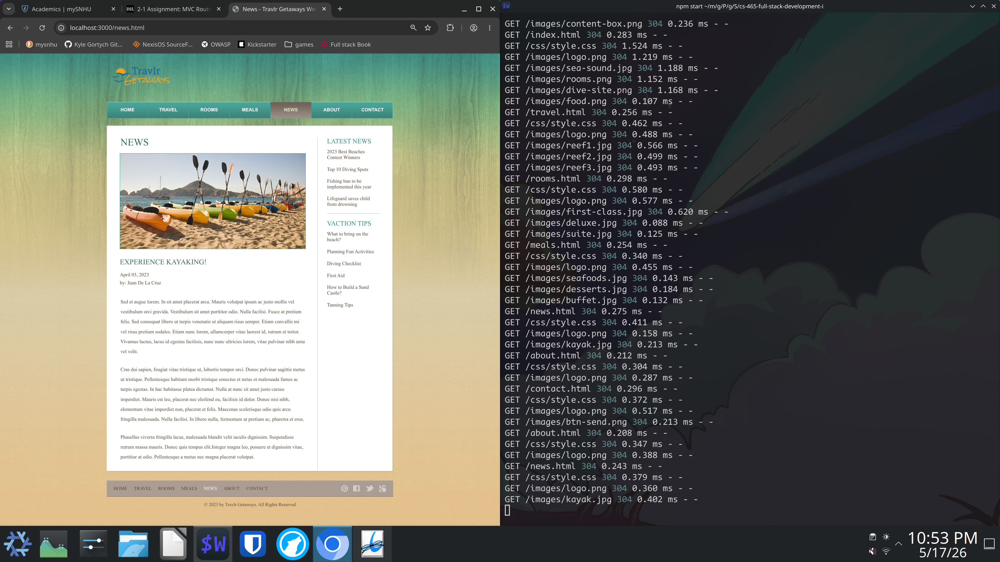

<div align="right">
 


</div>

# CS-465 Full Stack Development I
Project work from Full Stack Development I 


## About
This branch shows a collection of work for module 1.

## Getting Started
Setup is done via `git clone url`.

Then the dependecies to add are in blank .

git submodules blank list are initialized via `git submodule update --init --recursive`

## Installation

### Tools
Installation best via a system level package manager or ephemeral build environment.
Transitvie dependecies such as language are shown via tree level.

- git
- node
- express-generator

### Launch Local Project 
After running commands below view via **http://localhost:3000/**

```bash
npm install
npm audit
npm start
```

## Resolved Issues
Used npx to run express-generator rather than **npm install -g**.
Resolved frontend issue with missing style for website by renaming directory stylesheets to css.

## Project Structure 
express-generator was ran in repo root and moved assets into repectrive locations.

- **app.js** The entry point for express
- **bin/www** Server startup script
- **routes/** Backend routing logic
- **public/** Static frontend
- **views/** Template views from handlebars

### Screenshot of Server Running

<div align="center">
  
</div>
