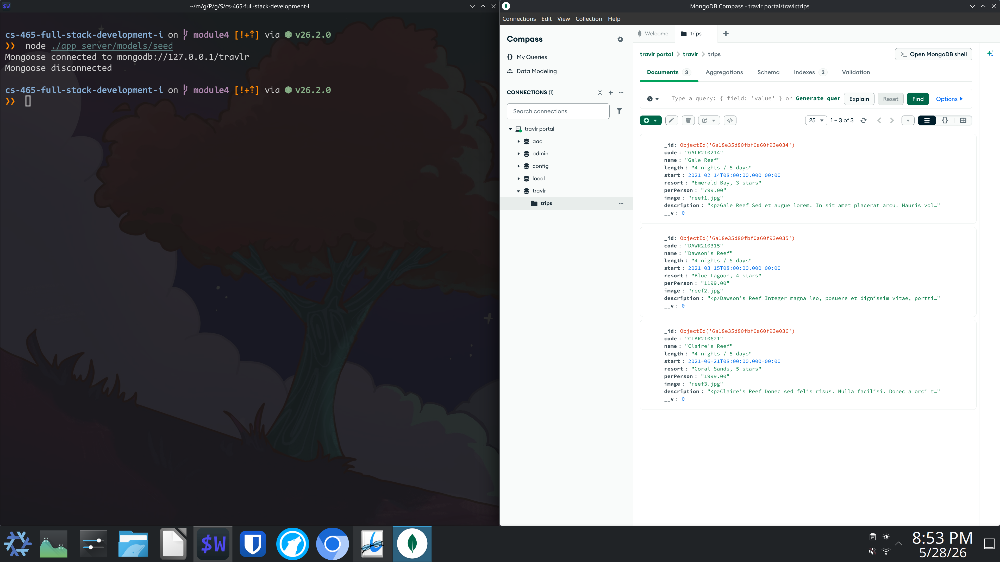

<div align="right">
 


</div>

# CS-465 Full Stack Development I
Project work from Full Stack Development I 


## About
This branch shows a collection of work for module 7.

## Getting Started
Setup is done via `git clone url`.

Then the dependecies to add are in blank .

git submodules blank list are initialized via `git submodule update --init --recursive`

## Installation

### Tools
Installation best via a system level package manager or ephemeral build environment.
Transitvie dependecies such as language are shown via tree level.

- git
- node
- Docker
- express-generator

### Launch Project without container
After running commands below view via **http://localhost:3000/** or **http://localhost:4200/**

```bash
npm install
npm audit
npm start
```

### Launch Project via Docker
After running commands below view via **http://localhost:3000/** or **http://localhost:4200/**

```bash
docker compose up --build
```

## Resolved Issues


## Changes

### Screenshot of

<div align="center">
  
</div>
