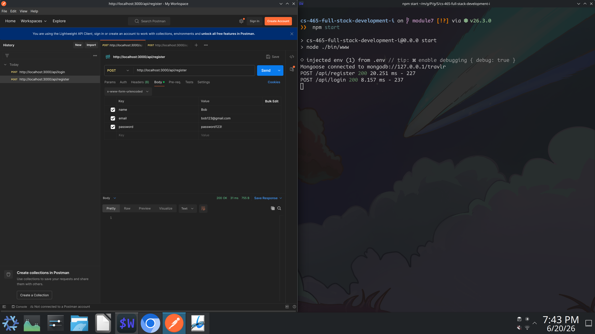
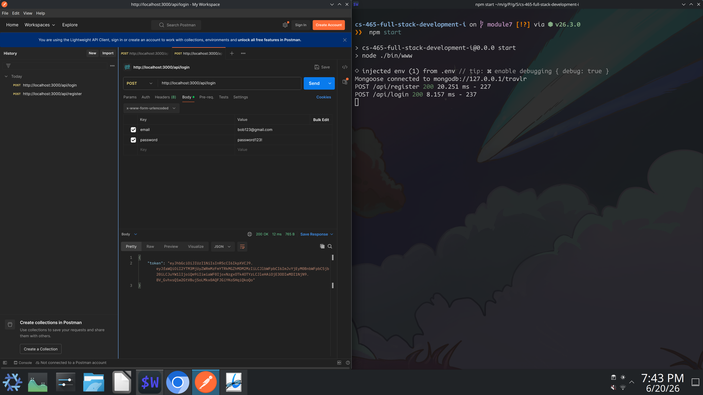
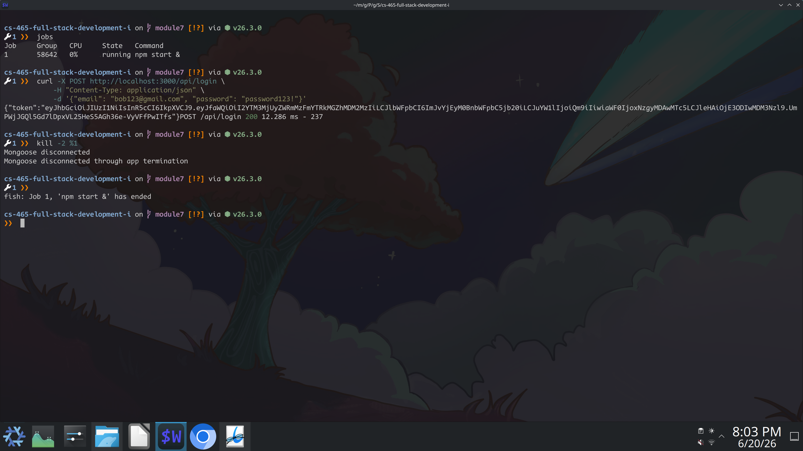
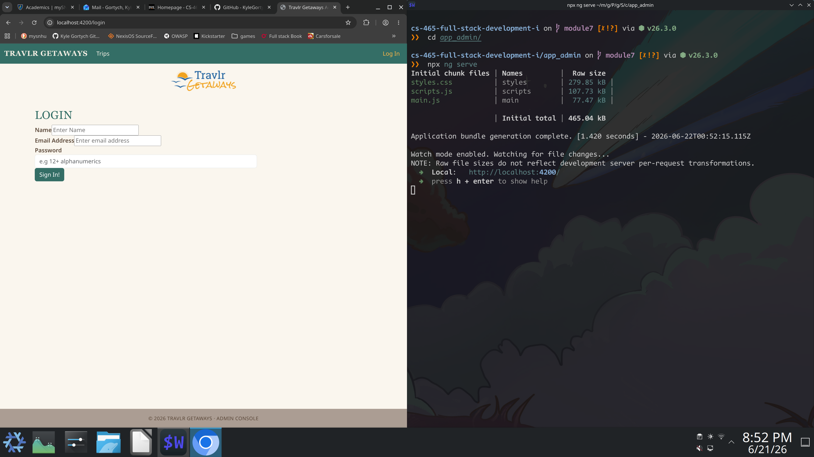
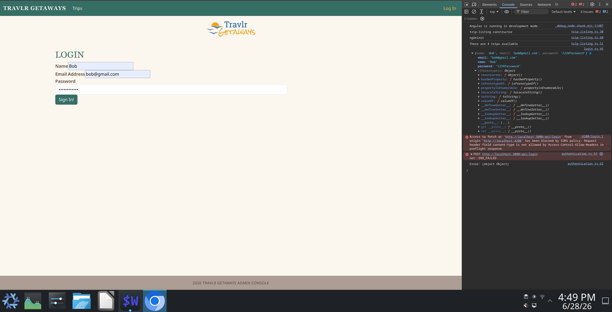
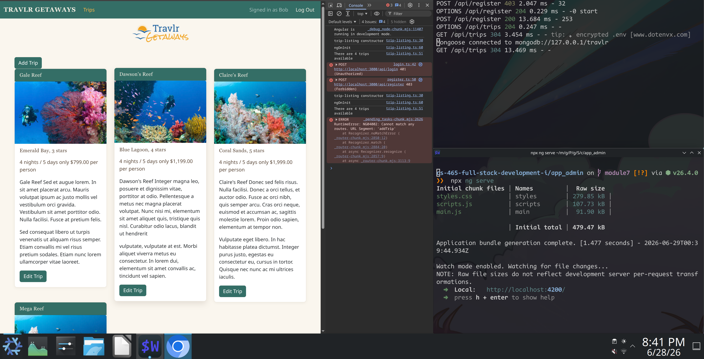

<div align="right">
 


</div>

# CS-465 Full Stack Development I
Project work from Full Stack Development I 


## About
This branch shows work for module 7 and final submission.

## Getting Started
Setup is done via `git clone url`.

Then the dependecies to add are in blank .

git submodules blank list are initialized via `git submodule update --init --recursive`

## Installation

<details>
<summary>Click to expand</summary>

### Tools
Installation best via a system level package manager or ephemeral build environment.
Transitvie dependecies such as language are shown via tree level.

- git
- node
- Docker
- express-generator

### Launch Project without container
After running commands below view via **http://localhost:3000/** or **http://localhost:4200/**

```bash
npm install
npm audit
npm start
```

### Launch Project via Docker
After running commands below view via **http://localhost:3000/** or **http://localhost:4200/**

```bash
docker compose up --build
```

</details>

## Questions Section

### Architecture

**Compare and contrast the types of frontend development you used in your full stack project, including Express HTML, JavaScript, and the single-page application (SPA).**

The frontend of the project has changed using three diffrent approaches. I used Express with Handlebars templates to generate HTML on the server. Each request needed to render a new page before sending it to the browser which wan't responsive.

I then used Javascript to add client-side functionality by allowin gthe browser to be responsive without requiring every action to reload the page.

The final implmentation used angular and a SPA single-page application for the administrative UI. Angular dynamicly updates the interface by communicating with Express API through the HTTP requests via app_api directory. Along with the SPA I added registration and roles for future changes if new users are needed.

**Why did the backend use a NoSQL MongoDB database?**

MongoDB was used as the data requried it to be flexible JSON documents which is simlar to Javascript objects used in the MEAN stack. This allowed me to use the Express API to get and send data without manual changes that would be required using a relational sql database.

### Functionality 

**How is JSON different from Javascript and how does JSON tie together the frontend and backend development pieces?**

JSON is the lightweight file type used for data formatting. It uses nesting and key value pairs similar to python dictionaries.

Using JSON lets the application communicate between Angular frontend and Express backend. Angular sends HTTP requests containing JSON data and then Express API processes it.

**Provide instances in the full stack process when you refactored code to improve functionality and efficiencies, and name the benefits that come from reusable user interface (UI) components.**

I refactored the code by orginizing it via Express controllers, API routes and models, and for frontend I moved API requests to Angular services inplace of HTTP logic in the componenets. 

### Testing

**Methods for request and retrieval necessitate various types of API testing of endpoints, in addition to the difficulties of testing with added layers of security. Explain your understanding of methods, endpoints, and security in a full stack application.**

HTTP methods define the operation perfromed on an API endpoint. GET gets the data, Post creates new records, PUT updates existing records, and DELETE removes records. The endpoints are specific URLs that expose the operations.

In order to test I organized it by unit, e2e for end to end, smoke, Postman API collections, integration, fixtures.


### Reflection

**How has this course helped you in reaching your professional goals? What skills have you learned, developed, or mastered in this course to help you become a more marketable candidate in your career field?**

This course has helped me understand the MEAN stack and diffrences between responsive and complexities in non responsive design. I leared to use Angular and Express along with Node.js and MongoDB with Mongoose. Lastly it requried use of RESTful APIs, authentication, roles for users in the SPA, and verifying database record updates.

## Screenshots

### Screenshot of register endpoint

<div align="center">
  
</div>

### Screenshot of login endpoint

<div align="center">
  
</div>

### Screenshot of Verifying via Terminal

<div align="center">
  
</div>

### Screenshot of admin login page

<div align="center">
  
</div>


### Screenshot of browser console debugging

<div align="center">
  
</div>

### Screenshot of admin successfully logged in

<div align="center">
  
</div>
